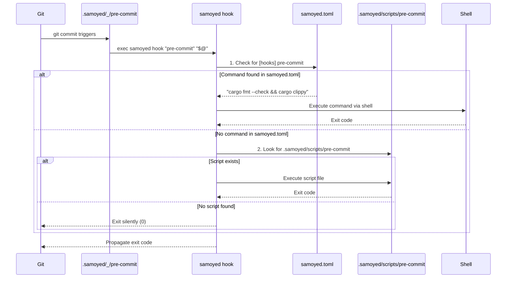

# Samoyed

[](https://github.com/nutthead/samoyed/actions/workflows/test.yml)&nbsp;&nbsp;[](https://codecov.io/gh/nutthead/samoyed)&nbsp;&nbsp;[](https://github.com/nutthead/samoyed/actions/workflows/test.yml)&nbsp;&nbsp;[](https://www.rust-lang.org)

A modern, fast, and secure Git hooks manager written in Rust. Samoyed is inspired by Husky with improved performance, better error handling, and enhanced security features.

You don't have to fuss with that pesky `package.json` file in your projects anymore! 🤌


## Key Rotation Policy

Signing keys are rotated every 10 years or immediately upon suspected compromise. Rotation involves generating new keys, updating GitHub secrets, and notifying users via security advisory.

## Test Coverage


## Features

- 🚀 **Fast**: Built with Rust for optimal performance
- 🔒 **Secure**: Comprehensive path validation and security checks
- 🛡️ **Robust**: Detailed error handling with actionable suggestions
- 🧪 **Well-tested**: Comprehensive test coverage with extensive integration tests
- 🌍 **Cross-platform**: Supports Linux, macOS, and Windows
- 📦 **Minimal dependencies**: Small set of essential Rust dependencies

## Installation

Samoyed is published on [crates.io](https://crates.io/crates/samoyed):

```bash
cargo install samoyed
```

## Verifying Release Signatures

All Samoyed release binaries are cryptographically signed with GPG to ensure authenticity and integrity. This protects against tampering and supply chain attacks.

### Quick Verification

For users who want to quickly verify a download:

```bash
# Download and import our public key
curl -sL https://github.com/nutthead/samoyed/releases/latest/download/samoyed-release-public.key | gpg --import

# Verify a binary (replace with your downloaded file)
gpg --verify samoyed-0.1.10-x86_64-unknown-linux-gnu.tar.gz.asc \
             samoyed-0.1.10-x86_64-unknown-linux-gnu.tar.gz
```

### Step-by-Step Verification Instructions

#### 1. Import the Samoyed Public Key

Download and import our signing key from the latest release:

```bash
# Download the public key
curl -sL https://github.com/nutthead/samoyed/releases/latest/download/samoyed-release-public.key -o samoyed-release-public.key

# Import the key into your GPG keyring
gpg --import samoyed-release-public.key
```

#### 2. Verify Key Fingerprint

**Critical Security Step**: Always verify the key fingerprint matches our official key:

```bash
gpg --fingerprint 02D1B70CF6D841EEE6876E13F7A6F8331CBBC51F
```

Expected output should show:
```
pub   ed25519 2025-01-01 [SC] [expires: 2035-01-01]
      02D1 B70C F6D8 41EE E687  6E13 F7A6 F833 1CBB C51F
uid           Behrang Saeedzadeh <hello@behrang.org>
sub   ed25519 2025-01-01 [E] [expires: 2035-01-01]
```

**⚠️ Security Warning**: If the fingerprint doesn't match exactly, do not proceed. This could indicate a compromised release.

#### 3. Download Release Files

Download the binary and its signature from the [releases page](https://github.com/nutthead/samoyed/releases):

```bash
# Example for Linux x86_64 (adjust for your platform)
wget https://github.com/nutthead/samoyed/releases/download/v0.1.10/samoyed-0.1.10-x86_64-unknown-linux-gnu.tar.gz
wget https://github.com/nutthead/samoyed/releases/download/v0.1.10/samoyed-0.1.10-x86_64-unknown-linux-gnu.tar.gz.asc
```

#### 4. Verify the Signature

```bash
gpg --verify samoyed-0.1.10-x86_64-unknown-linux-gnu.tar.gz.asc \
             samoyed-0.1.10-x86_64-unknown-linux-gnu.tar.gz
```

**Expected Output** (successful verification):
```
gpg: Signature made [date] using EdDSA key ID 1CBBC51F
gpg: Good signature from "Behrang Saeedzadeh <hello@behrang.org>" [unknown]
gpg: WARNING: This key is not certified with a trusted signature!
gpg:          There is no indication that the signature belongs to the owner.
```

The warning is normal unless you've explicitly trusted our key in your keyring.

#### 5. Verify Checksums (Optional but Recommended)

For additional security, verify the SHA256 checksums:

```bash
# Download checksums and signature
wget https://github.com/nutthead/samoyed/releases/download/v0.1.10/CHECKSUMS.txt
wget https://github.com/nutthead/samoyed/releases/download/v0.1.10/CHECKSUMS.txt.asc

# Verify checksums signature
gpg --verify CHECKSUMS.txt.asc CHECKSUMS.txt

# Verify your binary's checksum
sha256sum -c CHECKSUMS.txt --ignore-missing
```

### Platform-Specific Instructions

#### Linux

Linux distributions typically have GPG pre-installed. If not:

```bash
# Ubuntu/Debian
sudo apt update && sudo apt install gnupg

# RHEL/CentOS/Fedora
sudo dnf install gnupg2
# or for older systems: sudo yum install gnupg2

# Arch Linux
sudo pacman -S gnupg
```

#### macOS

Install GPG using Homebrew:

```bash
# Install Homebrew if not already installed
/bin/bash -c "$(curl -fsSL https://raw.githubusercontent.com/Homebrew/install/HEAD/install.sh)"

# Install GPG
brew install gnupg
```

Alternative: Download [GPG Suite](https://gpgtools.org/) for a GUI experience.

#### Windows

**Option 1: GPG4Win (Recommended)**
1. Download and install [GPG4Win](https://gpg4win.org/download.html)
2. Use Kleopatra (GUI) or `gpg` command in Command Prompt/PowerShell

**Option 2: Git for Windows**
If you have Git for Windows installed, GPG is included:
```cmd
# Use Git Bash terminal
gpg --version
```

**Option 3: Windows Subsystem for Linux (WSL)**
```bash
# In WSL terminal
sudo apt update && sudo apt install gnupg
```

**PowerShell Example**:
```powershell
# Import key
gpg --import samoyed-release-public.key

# Verify signature
gpg --verify samoyed-0.1.10-x86_64-pc-windows-msvc.zip.asc samoyed-0.1.10-x86_64-pc-windows-msvc.zip
```

### Troubleshooting Common Issues

#### "gpg: command not found"

**Cause**: GPG is not installed or not in your PATH.

**Solutions**:
- **Linux**: Install via package manager (see platform instructions above)
- **macOS**: Install via Homebrew: `brew install gnupg`
- **Windows**: Install GPG4Win or use Git Bash

#### "gpg: Can't check signature: No public key"

**Cause**: You haven't imported our public key yet.

**Solution**:
```bash
# Import the public key first
curl -sL https://github.com/nutthead/samoyed/releases/latest/download/samoyed-release-public.key | gpg --import
```

#### "gpg: BAD signature"

**Cause**: The file has been tampered with or corrupted.

**Solutions**:
1. **Re-download** the file and signature from GitHub releases
2. **Verify the download URL** - ensure you're downloading from `github.com/nutthead/samoyed`
3. **Check file integrity** - compare file size with the release page
4. **Report the issue** if problem persists

#### "WARNING: This key is not certified with a trusted signature"

**Cause**: This is normal behavior. GPG warns when you haven't explicitly trusted a key.

**This is NOT an error**. The important part is seeing "Good signature from...".

**To remove the warning** (optional):
```bash
# Trust our key (do this only after verifying the fingerprint)
gpg --edit-key 02D1B70CF6D841EEE6876E13F7A6F8331CBBC51F
# Type "trust" then "5" (ultimate trust) then "y" then "quit"
```

#### "gpg: signing failed: Inappropriate ioctl for device"

**Cause**: GPG agent configuration issue (usually on headless systems).

**Solution**:
```bash
export GPG_TTY=$(tty)
# Add to your ~/.bashrc or ~/.zshrc to make permanent
```

#### Signature file not found

**Cause**: You're trying to verify a file without downloading its `.asc` signature.

**Solution**: Always download both files:
```bash
# Download binary
wget https://github.com/nutthead/samoyed/releases/download/v0.1.10/samoyed-0.1.10-linux.tar.gz
# Download signature
wget https://github.com/nutthead/samoyed/releases/download/v0.1.10/samoyed-0.1.10-linux.tar.gz.asc
```

#### Old GPG version compatibility

**Cause**: Very old GPG versions (< 2.1) may not support Ed25519 keys.

**Solution**:
- **Update GPG** to version 2.1 or newer
- **Check version**: `gpg --version`
- Most systems from 2014+ have compatible versions

#### Network issues downloading keys

**Cause**: Firewall or network restrictions.

**Alternative methods**:
```bash
# Method 1: Direct download
wget https://github.com/nutthead/samoyed/releases/latest/download/samoyed-release-public.key

# Method 2: From repository
wget https://raw.githubusercontent.com/nutthead/samoyed/main/samoyed-release-public.key

# Method 3: Manual import (copy key content and save to file)
cat > samoyed-release-public.key << 'EOF'
[paste key content here]
EOF
```

### Verification Best Practices

1. **Always verify signatures** before extracting or running binaries
2. **Verify the key fingerprint** against multiple sources (GitHub, documentation, social media)
3. **Use secure download channels** - always download from `github.com/nutthead/samoyed`
4. **Keep GPG updated** - use recent versions for best security and compatibility
5. **Report suspicious activity** - if verification fails, report it immediately

### Security Contact

For security-related issues or questions about signature verification:
- **GitHub Issues**: [Security-related issues](https://github.com/nutthead/samoyed/issues/new?labels=security)
- **Email**: hello@behrang.org (for private security reports)

## Migration Guide

### Upgrading from Dual-Binary Versions (v0.1.x)

⚠️ **Important**: Samoyed has migrated from a dual-binary architecture (`samoyed` + `samoyed-hook`) to a unified single binary (`samoyed` with `hook` subcommand).

#### What Changed

- **Before**: `exec samoyed-hook "pre-commit" "$@"`
- **After**: `exec samoyed hook "pre-commit" "$@"`

#### Migration Steps

1. **Update Samoyed**: Install the latest version
   ```bash
   cargo install samoyed
   ```

2. **Re-initialize Your Hooks**: This updates your `.samoyed/_/*` files to use the new unified binary
   ```bash
   # Option 1: Standard re-initialization (recommended)
   # Safe to run multiple times, updates hooks only if needed
   samoyed init

   # Option 2: Force re-initialization (explicit migration)
   # Explicitly overwrites all hook files to ensure complete migration
   samoyed init -f _
   ```

   **When to use each option:**
   - Use `samoyed init` for normal migration (safe, non-destructive)
   - Use `samoyed init -f _` if you want to force complete re-creation of all hook files

3. **Verify Migration**: Check that your hook files now reference `samoyed hook`
   ```bash
   cat .samoyed/_/pre-commit
   # Should show: exec samoyed hook "$(basename "$0")" "$@"
   ```

#### Deprecation Timeline

- **Now**: `samoyed-hook` binary still works but shows deprecation warnings
- **September 1, 2025**: `samoyed-hook` binary will be removed entirely
- **Recommended**: Migrate immediately to avoid future issues

#### Troubleshooting

If you encounter issues:
- Ensure you have the latest version: `samoyed --version`
- Re-run `samoyed init` to refresh all hook files
- Check that `samoyed hook --help` works

## Quick Start

Initialize Git hooks in your repository:

```bash
samoyed init
```

This will:
1. Configure Git to use `.samoyed/_` as the hooks directory
2. Create the hooks directory structure
3. Install hook files that delegate to the `samoyed` binary

## Usage

### Basic Commands

```bash
# Initialize hooks (one-time setup)
samoyed init

# Install hooks with custom directory
samoyed init --hooks-dir custom-hooks
```

## Architecture

Samoyed uses a three-layer architecture that provides both flexibility and performance:

### Binary Component

- **`samoyed`**: Unified binary for both CLI interface and hook execution

### Execution Flow



### Directory Structure

When you run `samoyed init`, three key components are created:

#### 1. `samoyed.toml` - Primary Configuration
**Raison d'être**: The primary configuration mechanism where you define commands for each hook.

```toml
[hooks]
pre-commit = "cargo fmt --check && cargo clippy -- -D warnings"
pre-push = "cargo test --release"
```

#### 2. `.samoyed/_/` - Git Hook Delegation Layer
**Raison d'être**: Git integration. These files tell Git "when you want to run a hook, call samoyed hook instead."

All files contain identical delegation code:
```bash
#!/usr/bin/env sh
exec samoyed hook "$(basename "$0")" "$@"
```

Git's `core.hooksPath=.samoyed/_` points here, so `git commit` → `.samoyed/_/pre-commit` → `samoyed hook`.

#### 3. `.samoyed/scripts/` - Fallback & Examples
**Raison d'être**: Fallback mechanism for complex scenarios and examples for users who prefer script files.

### Two-Tier Lookup System

The hook runner implements a sophisticated two-tier lookup:

1. **Primary**: Check `samoyed.toml` for a command string
2. **Fallback**: Look for executable script in `.samoyed/scripts/`

This provides maximum flexibility:
- **Simple cases**: Use TOML configuration for straightforward commands
- **Complex cases**: Use full script files for multi-line logic or complex workflows

### Environment Variables

- `SAMOYED=0` - Skip all hook execution (useful for CI/deployment)
- `SAMOYED=1` - Normal execution mode (default)
- `SAMOYED=2` - Enable debug mode with detailed script tracing

### Performance Design

This architecture ensures minimal overhead:
- Git only spawns one process: `samoyed hook`
- No file system scanning during execution
- Direct command execution via shell when possible
- Graceful fallback with silent exit when no hooks are defined

## Development

### Prerequisites

- Rust 1.85+ (Rust 2024 edition)
- Git

### Building

```bash
# Build debug version
cargo build

# Build release version
cargo build --release

# Run tests
cargo test

# Run benchmarks
cargo bench
```

### Testing

The project uses comprehensive testing with dependency injection:

```bash
# Run all tests
cargo test

# Run specific test categories
cargo test --test installation_tests
cargo test --test validation_tests
cargo test --test error_handling_tests

# Run platform-specific tests
cargo test --test linux_tests    # Linux only
cargo test --test macos_tests    # macOS only
cargo test --test windows_tests  # Windows only
```

### Code Coverage

Generate coverage reports:

```bash
cargo tarpaulin --verbose --bins --all-features
```

Tarpaulin is configured in [.tarpaulin.toml](.tarpaulin.toml) to store reports in <target/tarpaulin/coverage/>.

## Contributing

1. Let's [discuss](https://github.com/nutthead/samoyed/discussions)
2. Fork the repository
3. Create a feature branch
4. Make your changes
5. Add tests for new functionality
6. Ensure all tests pass
7. Submit a pull request

## License

This project is licensed under the MIT License - see the [LICENSE](LICENSE) file for details.

## Acknowledgments

- Inspired by [Husky](https://typicode.github.io/husky/)
- Built with 🤪 in Rust
