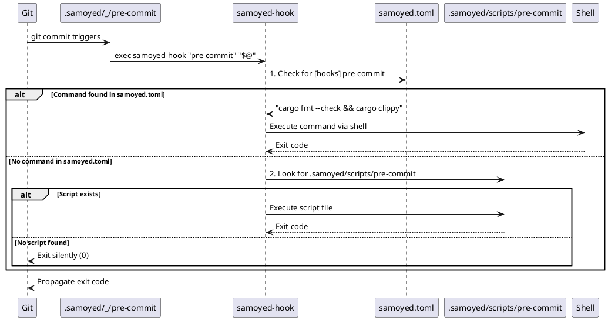

# Samoyed

[](https://github.com/nutthead/samoyed/actions/workflows/test.yml)  [](https://codecov.io/gh/nutthead/samoyed)  [](https://github.com/nutthead/samoyed/actions/workflows/test.yml)  [](https://www.rust-lang.org)

A modern, fast, and secure Git hooks manager written in Rust. Samoyed is inspired by Husky with improved performance, better error handling, and enhanced security features.

You don’t have to fuss with that pesky `package.json` file in your projects anymore! 🤌


## Test Coverage


## Features

- 🚀 **Fast**: Built with Rust for optimal performance
- 🔒 **Secure**: Comprehensive path validation and security checks
- 🛡️ **Robust**: Detailed error handling with actionable suggestions
- 🧪 **Well-tested**: Comprehensive test coverage with extensive integration tests
- 🌍 **Cross-platform**: Supports Linux, macOS, and Windows
- 📦 **Minimal dependencies**: Small set of essential Rust dependencies

## Installation

```bash
cargo install samoyed
```

## Quick Start

Initialize Git hooks in your repository:

```bash
samoyed init
```

This will:
1. Configure Git to use `.samoyed/_` as the hooks directory
2. Create the hooks directory structure
3. Install hook files that delegate to the `samoyed-hook` runner

## Usage

### Basic Commands

```bash
# Initialize hooks (one-time setup)
samoyed init

# Install hooks with custom directory
samoyed init --hooks-dir custom-hooks
```

### Environment Variables

- `SAMOYED=0` - Skip hook installation entirely
- `SAMOYED_DEBUG=1` - Enable debug logging

## Architecture

Samoyed uses a three-layer architecture that provides both flexibility and performance:

### Binary Components

- **`samoyed`**: CLI interface for initialization and management
- **`samoyed-hook`**: Lightweight hook runner executed by Git

### Execution Flow




### Directory Structure

When you run `samoyed init`, three key components are created:

#### 1. `samoyed.toml` - Primary Configuration
**Raison d'être**: The primary configuration mechanism where you define commands for each hook.

```toml
[hooks]
pre-commit = "cargo fmt --check && cargo clippy -- -D warnings"
pre-push = "cargo test --release"
```

#### 2. `.samoyed/_/` - Git Hook Delegation Layer
**Raison d'être**: Git integration. These files tell Git "when you want to run a hook, call samoyed-hook instead."

All files contain identical delegation code:
```bash
#!/usr/bin/env sh
exec samoyed-hook "$(basename "$0")" "$@"
```

Git's `core.hooksPath=.samoyed/_` points here, so `git commit` → `.samoyed/_/pre-commit` → `samoyed-hook`.

#### 3. `.samoyed/scripts/` - Fallback & Examples
**Raison d'être**: Fallback mechanism for complex scenarios and examples for users who prefer script files.

### Two-Tier Lookup System

The hook runner implements a sophisticated two-tier lookup:

1. **Primary**: Check `samoyed.toml` for a command string
2. **Fallback**: Look for executable script in `.samoyed/scripts/`

This provides maximum flexibility:
- **Simple cases**: Use TOML configuration for straightforward commands
- **Complex cases**: Use full script files for multi-line logic or complex workflows

### Environment Variables

- `SAMOYED=0` - Skip all hook execution (useful for CI/deployment)
- `SAMOYED=1` - Normal execution mode (default)
- `SAMOYED=2` - Enable debug mode with detailed script tracing

### Performance Design

This architecture ensures minimal overhead:
- Git only spawns one process: `samoyed-hook`
- No file system scanning during execution
- Direct command execution via shell when possible
- Graceful fallback with silent exit when no hooks are defined

## Development

### Prerequisites

- Rust 1.85+ (Rust 2024 edition)
- Git

### Building

```bash
# Build debug version
cargo build

# Build release version
cargo build --release

# Run tests
cargo test

# Run benchmarks
cargo bench
```

### Testing

The project uses comprehensive testing with dependency injection:

```bash
# Run all tests
cargo test

# Run specific test categories
cargo test --test installation_tests
cargo test --test validation_tests
cargo test --test error_handling_tests

# Run platform-specific tests
cargo test --test linux_tests    # Linux only
cargo test --test macos_tests    # macOS only
cargo test --test windows_tests  # Windows only
```

### Code Coverage

Generate coverage reports:

```bash
cargo tarpaulin --out html --output-dir target/coverage
```

## Contributing

1. Let's [discuss](https://github.com/nutthead/samoyed/discussions)
2. Fork the repository
3. Create a feature branch
4. Make your changes
5. Add tests for new functionality
6. Ensure all tests pass
6. Submit a pull request

## License

This project is licensed under the MIT License - see the [LICENSE](LICENSE) file for details.

## Acknowledgments

- Inspired by [Husky](https://typicode.github.io/husky/)
- Built with 🤟 🫡 in Rust
